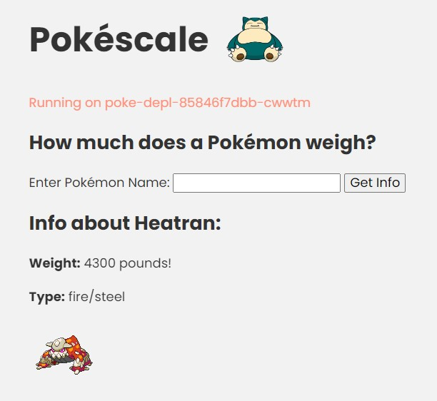

# Pokéscale - a scalable scale for Pokemons

This project accompanies my Workshop for teaching DevOps, Cloud & SE technics.  
Written in cloudnative Microservice-Architecture.

## Topics
- Linux / WSL2
- Git / SCM
- VSCode 
- Containerization / Docker
- Client-Side-Rendering / Server-Side-Rendering / SPAs
- Microservice-Architecture
- SE with Python
- HTML / JavaScript
- RestAPI
- CI/CD
- Kubernetes
- (Terraform)
- (Ansible)
- Deployment & Operation + Serverless
