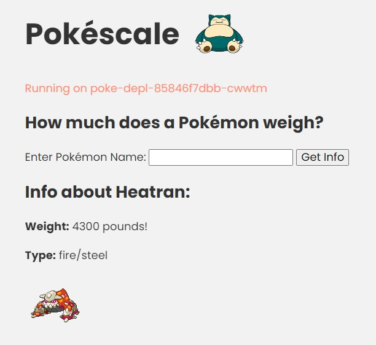

# Pokéscale - a scalable scale for Pokemons

This project accompanies my Workshop for teaching DevOps, Cloud & SE technics.  
Written in cloudnative Microservice-Architecture.



## Topics
- Linux / WSL2
- Git / SCM
- VSCode 
- Containerization / Docker
- Client-Side-Rendering / Server-Side-Rendering / SPAs
- Microservice-Architecture
- SE with Python
- HTML / JavaScript
- RestAPI
- CI/CD
- Kubernetes
- (Terraform)
- (Ansible)
- Deployment & Operation + Serverless

## Setup and use
Use the container image:
```
docker run -dp 80:8000 --name pokescale ghcr.io/xamma/pokescale:latest
```

Or run locally after cloning the repo:
```
cd src/main
python api.py
```

You can also use the helm chart ***pokescale*** under https://xamma.github.io/helm-charts for deploying.  